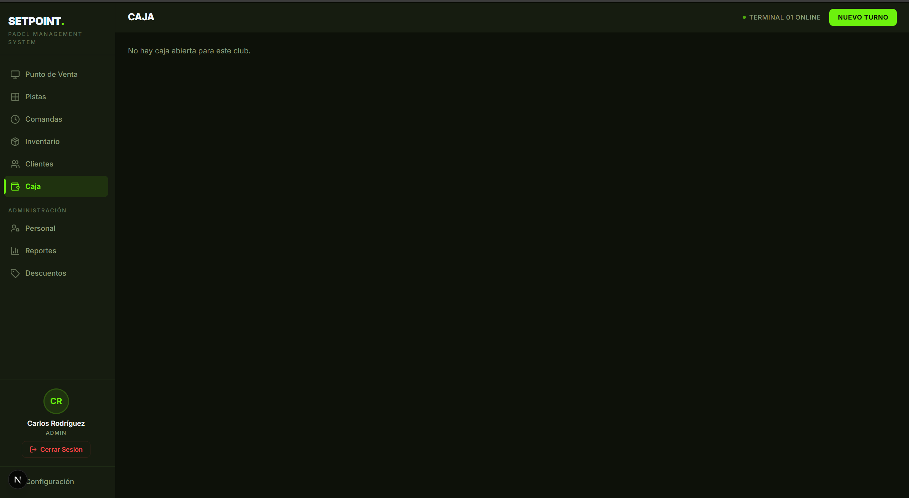

# Diseño — Módulo de Caja: Control Total de Turnos

**Fecha:** 2026-03-19
**Estado:** Aprobado
**Módulo:** `/caja` — `apps/dashboard/src/components/modules/caja/`

---

## Problema

El módulo de Caja tiene tres fallas críticas:
1. El botón "Nuevo Turno" en TopBar no tiene `onClick` — es decorativo
2. `closeCaja()` solo actualiza `cajas.estado` pero no cierra el turno (`turnos.fin`, `turnos.activo`)
3. Cuando no hay caja activa, la página muestra solo texto sin acción posible

---

## Decisiones de Diseño

| Pregunta | Decisión |
|----------|----------|
| Info al abrir turno | Fondo inicial + tipo (mañana/tarde/noche) + cajero |
| Cortes | Parciales (retiro a mitad de turno) + cierre final |
| Estado sin turno | Pantalla histórica + último cierre destacado + botón "Abrir Turno" |
| Comprobante corte parcial | Registro digital + imprimible vía `window.print()` |

---

## Arquitectura

`CajaPage` tiene dos modos según si existe `cajas.estado = 'abierta'`:

```
CajaPage
├── [sin turno activo]  →  CajaClosedView
│     ├── Header prominente: "Sin Turno Activo" + botón "Abrir Turno"
│     ├── Último cierre destacado (cajero, hora, ventas, diferencia)
│     └── Historial de cierres anteriores (últimos 10, colapsables)
│
└── [turno activo]  →  CajaOpenView (refactorizado)
      ├── Stats: ventas, efectivo, tarjeta, propinas
      ├── Desglose por método de pago
      └── Acciones: Corte Parcial | Cerrar Turno | Movimiento de Caja | Historial
```

---

## UI por Componente

### CajaClosedView
```
┌─────────────────────────────────────────────────────────┐
│  ⬤ SIN TURNO ACTIVO                  [+ ABRIR TURNO]   │
├─────────────────────────────────────────────────────────┤
│  ÚLTIMO CIERRE                                          │
│  Carlos Rodríguez · Tarde · 18 mar 2026 · 22:14        │
│  Ventas: $3,750  │  Diferencia: +$20  │  [Cerrado]     │
├─────────────────────────────────────────────────────────┤
│  HISTORIAL (últimos 10)                                 │
│  › 17 mar · Tarde · $4,100 · $0.00 dif                 │
│  › 16 mar · Noche · $2,800 · -$50.00 dif               │
└─────────────────────────────────────────────────────────┘
```

### OpenShiftModal (NUEVO)
- Tipo de turno: chips [Mañana] [Tarde] [Noche] — auto-selecciona por hora
- Cajero: selector de empleados activos
- Fondo inicial: input numérico
- Notas: opcional
- Acción: INSERT turnos + INSERT cajas

### PartialCutModal (NUEVO)
- Muestra efectivo calculado en caja
- Input: monto a retirar
- Concepto: texto
- Muestra nuevo fondo resultante (calculado)
- Post-guardar: muestra comprobante imprimible con `window.print()`

### CloseShiftModal (MODIFICAR)
- Igual al actual (paso 1: conteo, paso 2: resumen + diferencia)
- Fix: al confirmar también hace `UPDATE turnos SET fin=now(), activo=false`

---

## Cambios en queries/caja.ts

```typescript
// NUEVO
openCaja(supabase, clubId, empleadoId, tipo, fondoInicial, notas?)
  → INSERT turnos { club_id, empleado_id, tipo, inicio: now(), activo: true }
  → INSERT cajas { club_id, turno_id, fondo_inicial, estado: 'abierta' }
  → Retorna { turnoId, cajaId }

// ARREGLAR — agregar turnoId param y cerrar turno
closeCaja(supabase, cajaId, turnoId, contado, esperado)
  → UPDATE cajas SET estado='cerrada', total_efectivo=contado, diferencia=..., cerrada_at=now()
  → UPDATE turnos SET fin=now(), activo=false WHERE id=turnoId

// NUEVO
insertCorteParcial(supabase, cajaId, montoRetiro, concepto)
  → INSERT movimientos_caja { caja_id, tipo: 'retiro', concepto, monto }
  → Retorna MovimientoCaja completo para comprobante
```

**Sin cambios en esquema de DB.** Todo cabe en `cajas`, `turnos`, `movimientos_caja`.

---

## Comprobante de Corte Parcial

Generado en browser con `window.print()`. Estructura:
- Club, fecha/hora, cajero, tipo de turno
- Monto retirado, nuevo fondo en caja
- Número de corte (correlativo del turno)
- Espacio para firma física

Implementado como `<div id="comprobante-corte">` con CSS `@media print { body > * { display: none } #comprobante-corte { display: block } }`.

---

## TopBar "Nuevo Turno"

El botón ya existe en `TopBar.tsx` pero sin `onClick`. La solución: cuando `CajaPage` detecta que no hay turno activo, expone el handler de apertura a través del store global (`useAppStore`) o un evento custom. TopBar lee ese estado y conecta el botón.

Alternativa más simple: el botón solo es funcional en la ruta `/caja` — en otras rutas redirige a `/caja` primero.

---

## Archivos a Crear/Modificar

| Archivo | Acción |
|---------|--------|
| `caja/CajaPage.tsx` | MODIFICAR — dos modos: open/closed view |
| `caja/OpenShiftModal.tsx` | CREAR |
| `caja/PartialCutModal.tsx` | CREAR |
| `caja/CloseShiftModal.tsx` | MODIFICAR — fix turno close |
| `lib/supabase/queries/caja.ts` | MODIFICAR — openCaja(), fix closeCaja(), insertCorteParcial() |
| `components/layout/TopBar.tsx` | MODIFICAR — onClick "Nuevo Turno" |
